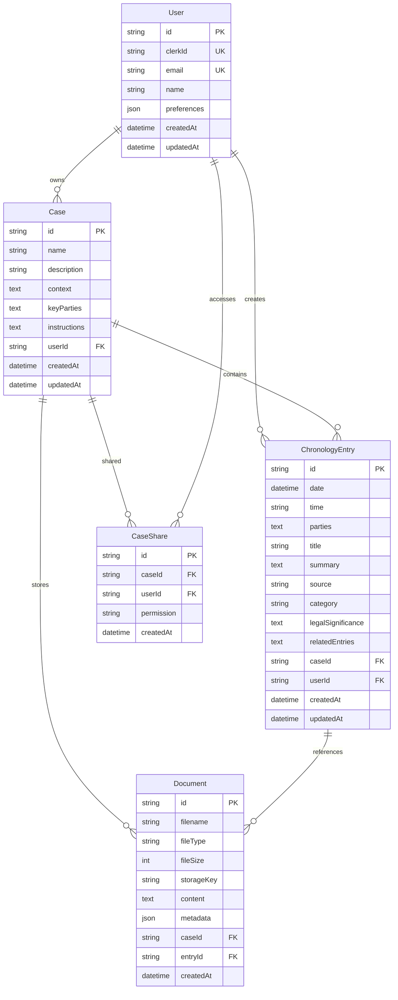

# Technical Design Document: Litigation Chronology Manager

## 1. Executive Summary

### 1.1 Project Overview

The Litigation Chronology Manager is a web-based application designed to help litigation attorneys create, manage, and analyze case chronologies using AI-powered document analysis. This document outlines the technical design for migrating the existing React application to a full-stack Next.js 15 implementation with database persistence, enhanced file handling, and multi-user support.

### 1.2 Key Objectives

- Migrate from client-side React to full-stack Next.js 15
- Implement persistent data storage with PostgreSQL
- Add secure file storage and processing capabilities
- Enable multi-user support with authentication
- Enhance document analysis with improved AI integration
- Maintain and improve existing functionality

### 1.3 Success Criteria

- Zero data loss during migration
- Sub-2 second page load times
- 99.9% uptime
- Support for 100+ concurrent users
- Process documents up to 50MB
- Generate chronologies with 1000+ entries

## 2. System Architecture

### 2.1 High-Level Architecture

```
┌─────────────────┐     ┌─────────────────┐     ┌─────────────────┐
│                 │     │                 │     │                 │
│   Web Client    │────▶│   Next.js App   │────▶│   PostgreSQL    │
│   (Browser)     │     │   (Vercel)      │     │   (Supabase)    │
│                 │     │                 │     │                 │
└─────────────────┘     └────────┬────────┘     └─────────────────┘
                                 │
                    ┌────────────┼────────────┐
                    │            │            │
              ┌─────▼─────┐ ┌────▼────┐ ┌────▼────┐
              │           │ │         │ │         │
              │ Claude AI │ │   S3    │ │  Clerk  │
              │   API     │ │ Storage │ │  Auth   │
              │           │ │         │ │         │
              └───────────┘ └─────────┘ └─────────┘
```

### 2.2 Technology Stack

#### Frontend

- **Framework**: Next.js 15 (App Router)
- **Language**: TypeScript 5.x
- **Styling**: Tailwind CSS 3.x
- **UI Components**: Custom components with Lucide icons
- **State Management**: React hooks + Server Components
- **Form Handling**: React Hook Form
- **Data Fetching**: Server Components + SWR for client-side

#### Backend

- **Runtime**: Node.js 20.x
- **API**: Next.js Route Handlers
- **ORM**: Prisma 5.x
- **Validation**: Zod
- **File Processing**: Multer + custom parsers

#### Database

- **Primary**: PostgreSQL 15 (via Supabase)
- **Caching**: Redis (for session management)
- **Search**: PostgreSQL full-text search

#### Infrastructure

- **Hosting**: Vercel (Next.js app)
- **Database**: Supabase
- **File Storage**: AWS S3
- **CDN**: Cloudflare
- **Monitoring**: Sentry + Vercel Analytics

#### Third-Party Services

- **Authentication**: Clerk
- **AI/LLM**: Anthropic Claude API
- **Email**: Resend
- **PDF Processing**: pdf-parse
- **Document Parsing**: Mammoth (Word), Tesseract.js (OCR)

### 2.3 Component Architecture

```
app/
├── (auth)/
│   ├── sign-in/
│   ├── sign-up/
│   └── layout.tsx
├── (dashboard)/
│   ├── cases/
│   │   ├── page.tsx                 # Case list
│   │   ├── new/
│   │   │   └── page.tsx            # Create case
│   │   └── [caseId]/
│   │       ├── page.tsx            # Chronology view
│   │       ├── settings/
│   │       │   └── page.tsx        # Case settings
│   │       ├── entries/
│   │       │   └── [entryId]/
│   │       │       └── page.tsx    # Entry detail
│   │       └── export/
│   │           └── page.tsx        # Export options
│   └── layout.tsx
├── api/
│   ├── auth/
│   │   └── webhook/                # Clerk webhooks
│   ├── cases/
│   │   ├── route.ts               # GET, POST
│   │   └── [caseId]/
│   │       ├── route.ts           # GET, PUT, DELETE
│   │       └── entries/
│   │           ├── route.ts       # GET, POST
│   │           └── [entryId]/
│   │               └── route.ts   # GET, PUT, DELETE
│   ├── documents/
│   │   ├── upload/
│   │   │   └── route.ts          # POST multipart
│   │   ├── [documentId]/
│   │   │   └── route.ts          # GET, DELETE
│   │   └── analyze/
│   │       └── route.ts          # POST
│   └── export/
│       └── route.ts              # POST
├── layout.tsx
└── page.tsx
```

## 3. Database Design

### 3.1 Entity Relationship Diagram



### 3.2 Indexing Strategy

```sql
-- Performance indexes
CREATE INDEX idx_entry_case_date ON ChronologyEntry(caseId, date);
CREATE INDEX idx_entry_user ON ChronologyEntry(userId);
CREATE INDEX idx_document_case ON Document(caseId);
CREATE INDEX idx_case_user ON Case(userId);

-- Full-text search indexes
CREATE INDEX idx_entry_search ON ChronologyEntry
USING GIN(to_tsvector('english', title || ' ' || summary || ' ' || parties));

CREATE INDEX idx_document_content ON Document
USING GIN(to_tsvector('english', content));

-- JSON indexes for preferences
CREATE INDEX idx_user_preferences ON User
USING GIN(preferences);
```

## 4. API Design

### 4.1 RESTful Endpoints

#### Authentication

```
POST   /api/auth/webhook         # Clerk webhook for user sync
```

#### Cases

```
GET    /api/cases               # List user's cases
POST   /api/cases               # Create new case
GET    /api/cases/:id           # Get case details
PUT    /api/cases/:id           # Update case
DELETE /api/cases/:id           # Delete case (soft delete)
POST   /api/cases/:id/share     # Share case with user
```

#### Chronology Entries

```
GET    /api/cases/:caseId/entries              # List entries
POST   /api/cases/:caseId/entries              # Create entry
GET    /api/cases/:caseId/entries/:id          # Get entry
PUT    /api/cases/:caseId/entries/:id          # Update entry
DELETE /api/cases/:caseId/entries/:id          # Delete entry
GET    /api/cases/:caseId/entries/search       # Search entries
```

#### Documents

```
POST   /api/documents/upload                    # Upload document
GET    /api/documents/:id                       # Download document
DELETE /api/documents/:id                       # Delete document
POST   /api/documents/analyze                   # Analyze with Claude
GET    /api/documents/:id/text                  # Get extracted text
```

#### Export

```
POST   /api/export/chronology                   # Export as DOC/PDF
POST   /api/export/timeline                     # Export timeline view
GET    /api/export/:jobId/status               # Check export status
GET    /api/export/:jobId/download             # Download export
```

### 4.2 Request/Response Schemas

#### Create Entry Request

```typescript
interface CreateEntryRequest {
  date: string; // ISO 8601
  time?: string; // HH:MM
  parties: string;
  title: string;
  summary: string;
  source?: string;
  category: CategoryEnum;
  legalSignificance?: string;
  relatedEntries?: string[];
  documentIds?: string[];
}
```

#### Entry Response

```typescript
interface EntryResponse {
  id: string;
  date: string;
  time?: string;
  parties: string;
  title: string;
  summary: string;
  source?: string;
  category: string;
  legalSignificance?: string;
  relatedEntries?: string;
  documents: DocumentSummary[];
  caseId: string;
  userId: string;
  createdAt: string;
  updatedAt: string;
}
```

### 4.3 Error Handling

```typescript
interface ErrorResponse {
  error: {
    code: string;
    message: string;
    details?: any;
  };
  timestamp: string;
  path: string;
}

// Standard HTTP status codes
// 200 - Success
// 201 - Created
// 400 - Bad Request
// 401 - Unauthorized
// 403 - Forbidden
// 404 - Not Found
// 409 - Conflict
// 422 - Unprocessable Entity
// 500 - Internal Server Error
```

## 5. Security Design

### 5.1 Authentication & Authorization

#### Authentication Flow

1. User signs up/in via Clerk
2. Clerk webhook creates/updates user in database
3. JWT token validates requests
4. Session management via Clerk

#### Authorization Model

```typescript
enum Permission {
  OWNER = 'owner',
  EDITOR = 'editor',
  VIEWER = 'viewer'
}

// Authorization checks
- Case access: User must be owner or have share permission
- Entry CRUD: User must have editor permission or higher
- Document access: Inherited from case permissions
- Export: Viewer permission or higher
```

### 5.2 Data Security

#### Encryption

- **In Transit**: TLS 1.3 for all connections
- **At Rest**: AES-256 for S3 documents
- **Database**: Encrypted via Supabase

#### Input Validation

```typescript
// Zod schemas for all inputs
const EntrySchema = z.object({
  date: z.string().datetime(),
  title: z.string().min(1).max(500),
  summary: z.string().min(1).max(10000),
  category: z.enum(CATEGORIES),
  // ... etc
});
```

#### File Security

- Virus scanning via ClamAV
- File type validation
- Size limits (50MB default)
- Sandboxed processing environment

### 5.3 API Security

- Rate limiting: 100 requests/minute per user
- CORS configuration for production domains
- API key rotation for external services
- Request signing for S3 uploads
- CSRF protection via Double Submit Cookie

## 6. File Handling & Storage

### 6.1 Upload Flow

```
1. Client selects file
2. Pre-upload validation (type, size)
3. Request presigned S3 URL
4. Direct upload to S3
5. Webhook triggers processing
6. Extract text content
7. Store metadata in database
8. Trigger AI analysis (optional)
```

### 6.2 File Processing Pipeline

```typescript
interface FileProcessor {
  canProcess(mimeType: string): boolean;
  process(buffer: Buffer): Promise<ExtractedContent>;
}

class PDFProcessor implements FileProcessor {
  async process(buffer: Buffer) {
    // Use pdf-parse
  }
}

class WordProcessor implements FileProcessor {
  async process(buffer: Buffer) {
    // Use mammoth
  }
}

class ImageProcessor implements FileProcessor {
  async process(buffer: Buffer) {
    // Use Tesseract.js for OCR
  }
}

class EmailProcessor implements FileProcessor {
  async process(buffer: Buffer) {
    // Parse EML format
  }
}
```

### 6.3 Storage Structure

```
s3-bucket/
├── cases/
│   └── {caseId}/
│       ├── documents/
│       │   └── {timestamp}-{filename}
│       └── exports/
│           └── {timestamp}-chronology.pdf
└── temp/
    └── processing/
```

## 7. AI Integration

### 7.1 Claude Integration Architecture

```typescript
class ClaudeAnalyzer {
  private client: Anthropic;

  async analyzeDocument(content: string, caseContext: CaseContext): Promise<AnalysisResult> {
    const prompt = this.buildPrompt(content, caseContext);
    const response = await this.client.messages.create({
      model: "claude-3-opus-20240229",
      max_tokens: 4096,
      messages: [{ role: "user", content: prompt }],
      system: this.getSystemPrompt(caseContext),
    });

    return this.parseResponse(response);
  }
}
```

### 7.2 Prompt Engineering

```typescript
interface CaseContext {
  description: string;
  keyParties: string[];
  legalIssues: string[];
  instructions: string;
  existingEntries: EntrySummary[];
}

function buildPrompt(document: string, context: CaseContext): string {
  return `
    Analyze the following document in the context of this litigation:
    
    Case Context:
    ${context.description}
    
    Key Parties: ${context.keyParties.join(", ")}
    
    Document to Analyze:
    ${document}
    
    Extract and return in JSON format:
    - Date and time of events
    - Parties involved
    - Event summary
    - Legal significance
    - Related existing entries
  `;
}
```

### 7.3 Response Caching

```typescript
// Cache AI responses to reduce API calls
interface CachedAnalysis {
  documentHash: string;
  contextHash: string;
  analysis: AnalysisResult;
  timestamp: Date;
}

// Cache for 30 days unless document or context changes
```

## 8. Performance Optimization

### 8.1 Frontend Optimization

#### Next.js 15 Features

- Server Components for initial page load
- Streaming SSR for progressive rendering
- Parallel data fetching
- Automatic code splitting
- Image optimization with next/image

#### Client-Side Performance

```typescript
// Virtualization for large entry lists
import { VirtualList } from "@tanstack/react-virtual";

// Debounced search
const debouncedSearch = useMemo(() => debounce(handleSearch, 300), []);

// Optimistic updates
const optimisticUpdate = (entry) => {
  setEntries((prev) => [...prev, entry]);
  saveEntry(entry).catch(() => {
    setEntries((prev) => prev.filter((e) => e.id !== entry.id));
  });
};
```

### 8.2 Backend Optimization

#### Database Queries

```typescript
// Efficient pagination
const entries = await prisma.chronologyEntry.findMany({
  where: { caseId },
  skip: (page - 1) * pageSize,
  take: pageSize,
  orderBy: [{ date: "asc" }, { time: "asc" }],
  include: {
    documents: {
      select: { id: true, filename: true },
    },
  },
});

// Batch operations
const createEntries = await prisma.chronologyEntry.createMany({
  data: entries,
  skipDuplicates: true,
});
```

#### Caching Strategy

- Redis for session data
- Edge caching for static assets
- Database query caching
- S3 presigned URL caching

### 8.3 Scalability Considerations

#### Horizontal Scaling

- Stateless application design
- Database connection pooling
- Queue-based file processing
- Load balancing via Vercel

#### Resource Limits

```typescript
const LIMITS = {
  MAX_FILE_SIZE: 50 * 1024 * 1024, // 50MB
  MAX_ENTRIES_PER_CASE: 10000,
  MAX_DOCUMENTS_PER_CASE: 1000,
  MAX_EXPORT_ENTRIES: 5000,
  MAX_BATCH_OPERATIONS: 100,
  API_RATE_LIMIT: 100, // per minute
  CLAUDE_REQUESTS_PER_DAY: 1000,
};
```

## 9. Testing Strategy

### 9.1 Test Pyramid

```
         ┌───┐
        /     \        E2E Tests (10%)
       /       \       - Critical user journeys
      /─────────\      - Cross-browser testing
     /           \
    /             \    Integration Tests (30%)
   /───────────────\   - API endpoints
  /                 \  - Database operations
 /                   \ - File processing
/─────────────────────\
                       Unit Tests (60%)
                       - Components
                       - Utilities
                       - Business logic
```

### 9.2 Testing Tools

- **Unit Tests**: Jest + React Testing Library
- **Integration Tests**: Jest + Supertest
- **E2E Tests**: Playwright
- **Performance Tests**: k6
- **Security Tests**: OWASP ZAP

### 9.3 Test Coverage Goals

- Overall: 80%
- Critical paths: 95%
- API endpoints: 90%
- UI components: 70%

## 10. Deployment Strategy

### 10.1 Environments

```
Development → Staging → Production

dev.chronology.app
staging.chronology.app
app.chronology.com
```

### 10.2 CI/CD Pipeline

```yaml
# .github/workflows/deploy.yml
name: Deploy
on:
  push:
    branches: [main]

jobs:
  test:
    runs-on: ubuntu-latest
    steps:
      - uses: actions/checkout@v3
      - run: npm test
      - run: npm run test:e2e

  deploy:
    needs: test
    runs-on: ubuntu-latest
    steps:
      - uses: actions/checkout@v3
      - run: npm run build
      - uses: vercel/action@v1
```

### 10.3 Rollback Strategy

- Vercel automatic rollback on errors
- Database migrations with down scripts
- Feature flags for gradual rollout
- Blue-green deployment for major updates

## 11. Monitoring & Observability

### 11.1 Application Monitoring

#### Metrics to Track

- Response times (p50, p95, p99)
- Error rates by endpoint
- Active users
- Document processing times
- AI API usage
- Database query performance

#### Tools

- **APM**: Sentry
- **Analytics**: Vercel Analytics
- **Logs**: Vercel Logs
- **Uptime**: Better Uptime
- **Custom Metrics**: Prometheus + Grafana

### 11.2 Alerting Rules

```typescript
const alerts = [
  {
    name: "High Error Rate",
    condition: "error_rate > 5%",
    window: "5 minutes",
    severity: "critical",
  },
  {
    name: "Slow Response Time",
    condition: "p95_response_time > 2s",
    window: "10 minutes",
    severity: "warning",
  },
  {
    name: "Claude API Limit",
    condition: "claude_requests > 900",
    window: "24 hours",
    severity: "warning",
  },
];
```

## 12. Migration Plan

### 12.1 Phase 1: Foundation (Weeks 1-2)

- Set up Next.js 15 project
- Configure authentication (Clerk)
- Set up database (Supabase)
- Create basic CRUD APIs
- Migrate core UI components

### 12.2 Phase 2: Core Features (Weeks 3-4)

- Implement file upload to S3
- Add document processing pipeline
- Integrate Claude API
- Migrate chronology management
- Add search functionality

### 12.3 Phase 3: Advanced Features (Weeks 5-6)

- Implement export functionality
- Add case sharing
- Create notification system
- Implement audit logging
- Add performance monitoring

### 12.4 Phase 4: Testing & Optimization (Week 7)

- Comprehensive testing
- Performance optimization
- Security audit
- Documentation
- User training materials

### 12.5 Phase 5: Deployment (Week 8)

- Staging deployment
- User acceptance testing
- Production deployment
- Monitor and iterate

## 13. Risk Assessment & Mitigation

### 13.1 Technical Risks

| Risk                       | Impact | Probability | Mitigation                          |
| -------------------------- | ------ | ----------- | ----------------------------------- |
| Data loss during migration | High   | Low         | Comprehensive backups, parallel run |
| Claude API rate limits     | Medium | Medium      | Implement caching, queue system     |
| S3 costs exceed budget     | Medium | Low         | Monitor usage, implement quotas     |
| Performance degradation    | High   | Medium      | Load testing, caching strategy      |
| Security breach            | High   | Low         | Security audit, penetration testing |

### 13.2 Business Risks

| Risk                 | Impact | Probability | Mitigation                         |
| -------------------- | ------ | ----------- | ---------------------------------- |
| User adoption issues | High   | Medium      | Training, gradual rollout          |
| Feature parity gaps  | Medium | Low         | Detailed requirements mapping      |
| Compliance concerns  | High   | Low         | Legal review, audit trails         |
| Vendor lock-in       | Low    | Low         | Use standard formats, abstractions |

## 14. Cost Analysis

### 14.1 Infrastructure Costs (Monthly)

| Service    | Tier      | Estimated Cost |
| ---------- | --------- | -------------- |
| Vercel     | Pro       | $20            |
| Supabase   | Pro       | $25            |
| AWS S3     | 100GB     | $23            |
| Claude API | 1M tokens | $15            |
| Clerk      | Pro       | $25            |
| Monitoring | Various   | $50            |
| **Total**  |           | **$158/month** |

### 14.2 Development Costs

- Initial Development: 320 hours
- Testing & QA: 80 hours
- Documentation: 40 hours
- Training: 20 hours
- **Total: 460 hours**

## 15. Success Metrics

### 15.1 Technical KPIs

- Page load time < 2 seconds
- API response time < 500ms (p95)
- Uptime > 99.9%
- Zero data loss incidents
- Test coverage > 80%

### 15.2 Business KPIs

- User adoption rate > 80%
- Document processing accuracy > 95%
- Time saved per chronology > 50%
- User satisfaction score > 4.5/5
- Support ticket reduction > 30%

## 16. Appendices

### A. Database Migrations

```sql
-- Initial migration scripts
CREATE EXTENSION IF NOT EXISTS "uuid-ossp";
CREATE EXTENSION IF NOT EXISTS "pg_trgm";

-- Create tables...
```

### B. API Documentation

[Detailed OpenAPI specification available separately]

### C. Security Checklist

- [ ] HTTPS enforced
- [ ] Input validation on all endpoints
- [ ] SQL injection prevention
- [ ] XSS protection
- [ ] CSRF tokens
- [ ] Rate limiting
- [ ] Security headers
- [ ] Dependency scanning
- [ ] Penetration testing

### D. Compliance Considerations

- GDPR compliance for EU users
- SOC 2 Type II certification path
- Legal hold capabilities
- Audit trail requirements
- Data retention policies

---

**Document Version**: 1.0  
**Last Updated**: [Current Date]  
**Authors**: Technical Architecture Team  
**Reviewers**: CTO, Security Team, Legal Team  
**Approval Status**: DRAFT
